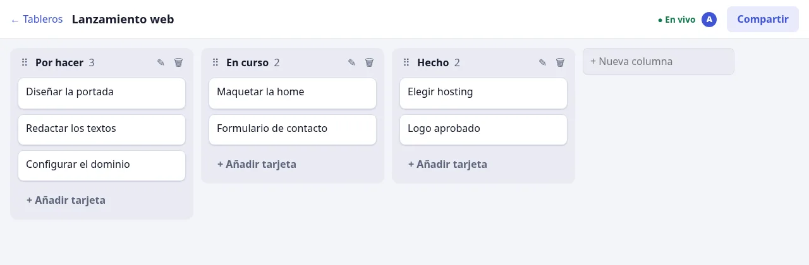

# Tablero

A collaborative Kanban board: several people edit the same board at the same time and see each other's changes as they happen,
drag cards with the mouse **or the keyboard**, and keep working when the connection drops.



Stack: Node + Fastify, PostgreSQL 17 (hand-written SQL migrations, `pg`), React 19 + Vite, `@dnd-kit`, Server-Sent Events, `zod`.
UI in Spanish.

The interesting part is what happens when *more than one person edits at once* and *the network is unreliable*.

## How it works

### Real time with Server-Sent Events, backed by a change log
Every change is appended to an `events` table **in the same transaction** that changes the data. A browser gets a snapshot
(state + the sequence number `seq` it corresponds to, read from one consistent transaction) and then follows the stream
"everything after `seq`". The stream is fed by Postgres `LISTEN/NOTIFY`, but delivery is driven by the table, not by the
notification: a lost, duplicated or late notification can only delay an update, never lose it.
`EventSource` re-sends `Last-Event-ID` when it reconnects, so a dropped connection resumes exactly where it stopped.
Tests cover: resume with no gaps and no repeats, snapshot → stream continuity, isolation between boards, and **killing the
server's own Postgres `LISTEN` connection mid-stream** (the hub reconnects and catches up).

Why SSE and not WebSockets: the traffic is one-directional (server → client; writes are plain HTTP `POST`s), SSE runs over
ordinary HTTP with built-in reconnection and resume, and it is simpler to operate behind proxies.

### Optimistic UI that reconciles with the server
`send(op)` shows the change instantly — the client predicts the result with the *same* function the server uses — and delivers
the operation in order. The screen is always *the server's state with unconfirmed operations replayed on top*
(`src/shared/sync.ts`, a pure reducer with its own tests):

- the prediction is dropped when the real events up to the operation's `seq` have arrived — no flicker, no duplicate;
- if the server rejects it (permission, validation, conflict) the prediction just disappears and the UI falls back to the truth;
- if the network fails the operation is **retried with the same operation id**, which the server treats idempotently (stored
  response is returned) — so a retry can never apply a change twice. An end-to-end test blocks a user's requests, keeps editing,
  restores the connection, and checks each change appeared exactly once.

### Ordering without renumbering: fractional indexing
Cards and columns carry a string key; putting an item between two others only needs a key between theirs, so a move writes
**one row** and two people moving different cards never conflict. Moves are expressed as "place right after card X", resolved
on the server against the *current* neighbours, so a concurrent edit turns into a sensible result rather than an error (if X was
deleted meanwhile, the card goes to the end).

**A gotcha worth knowing:** those keys are designed to be compared byte-wise. Postgres' default collation (`en_US.UTF-8`) sorts
`"a" < "B"`, which silently reorders items. The `position` columns are declared `COLLATE "C"`, and a test checks the order Postgres
returns equals the order JavaScript computes.

### Concurrency on the server
Each operation runs in one transaction serialised **per board** by a row lock. That guarantees positions cannot collide, and
that `seq` numbers follow commit order within a board (which is what makes "resume after N" correct). Tests fire 40 simultaneous
inserts at the same spot and a storm of conflicting moves and deletes: no server error, no duplicate positions.

### Security
- Accounts: scrypt password hashes, sessions stored as SHA-256 hashes, `HttpOnly` + `SameSite=Lax` cookie; 10 failed
  logins in 15 minutes lock an account; unknown email and wrong password are indistinguishable.
- **CSRF:** every state-changing request must carry a custom header, which a browser cannot add to a cross-site request without a
  CORS preflight (the server answers none); a test checks a valid session cookie alone is refused.
- **Authorization:** the board comes from the URL but membership is checked in the same transaction as the change; non-members
  get the same `404` as for a board that does not exist (existence is not leaked). Viewers get `403`. Every mutation is scoped by
  `board_id`, so ids from another board match nothing — tested for cards, columns and cross-board moves.
- Client-chosen ids (needed for optimistic UI) that already exist anywhere return a generic conflict.
- Strict input validation (`zod` strict objects, length limits), `Content-Security-Policy`, `X-Frame-Options`, `nosniff`.
- Invites are unguessable, expire after 72 h, are stored hashed, and never downgrade an existing member.

### Accessibility
Drag-and-drop works from the keyboard (Space to pick up, arrows to move, Space to drop; instructions in Spanish), covered by an
end-to-end test. Dialogs use the native `<dialog>` (focus trap, Escape, inert background); status changes are announced through
live regions; every control has an accessible name. **Not audited with a screen reader or automated tooling.**

## Run it

Requires Node 20.9+ and Docker (for Postgres).

```bash
npm install
cp .env.example .env            # optional; defaults match docker-compose
npm run db:up                   # Postgres 17 (throwaway, port 54330)
npm run db:migrate
npm run build                   # front-end → dist/
npm start                       # http://localhost:3200
# or, for development: npm run dev:server   and   npm run dev:web (Vite on :5173, proxies /api)
```

## Tests

```bash
npm test          # 52 tests: shared logic (unit) + API/SSE against real Postgres (throwaway database per run)
npm run test:e2e  # 9 browser tests (Playwright), on a freshly created database
```

The end-to-end tests drive real Chromium: mouse drag between and within columns, keyboard moves, column reorder/rename/delete,
two users editing at once until both screens converge, a read-only member, and the offline scenario.
`.github/workflows/ci.yml` runs typecheck and both suites (it has not run on GitHub yet — there is no repository).

## Limitations (honest list)

- **One writer at a time per board.** The per-board row lock makes correctness simple but caps write throughput for a single
  board (fine for teams; not for thousands of simultaneous editors on one board).
- **Conflicts are last-writer-wins per field.** Editing the same card's title at the same moment keeps the later one; there is no
  text merging (a card edit only sends the fields that changed, so different fields do not overwrite each other).
- **The event log is never pruned** and there is no snapshot compaction, so a very long-lived, very busy board grows.
- **Unsent operations live in memory:** if the user closes the tab while offline, what was not yet delivered is lost (nothing is
  stored in IndexedDB).
- Not implemented: removing members or changing their role, leaving/deleting a board, comments, labels, due dates, undo/redo,
  presence indicators, email verification or password reset, registration rate-limiting.
- Multi-instance fan-out relies on `LISTEN/NOTIFY` and is designed for it, but **I have only run a single server instance.**
- The offline end-to-end test blocks the user's write requests; Playwright's own "offline" switch does not sever an SSE stream
  that is already open, so stream reconnection is verified at the integration level (kill the `LISTEN` connection, resume from
  `Last-Event-ID`) rather than in the browser.
- Not deployed yet.

## Layout

```
db/migrations/      schema (COLLATE "C" positions, event log, idempotency table)
src/shared/         types, fractional ordering, board state, optimistic-sync reducer — used by client AND server
src/server/         Fastify app, board operations, SSE hub (LISTEN/NOTIFY), auth
src/web/            React app (drag-and-drop, sync hook)
test/               unit + integration (vitest)      e2e/   browser tests (Playwright)
```

## Licence
MIT
